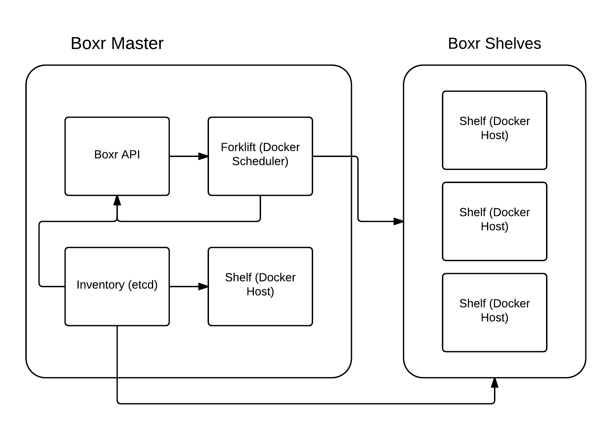

# Boxr Introduction

# The Parts

## Shelves

A shelf is essentially a docker host with the shelf deamon running on it 
giving [Forklift](#forklift) access to the hosts stats as well as manage the [Boxes](#box)
running on the host.

## Pallet 

A pallet is a complete set of boxes need to run an app this includes the 
app box and the services it depends on (not replicas of these machines).

## Box

A box is exactly what it sounds like, it's the individual machines that 
are needed to fill a pallet. In other words "Docker Containers".

## Forklift

The Forklift is the service that is in charge of creating and managing 
[Pallets](#pallet) it accomplishes this by monitoring existing boxes as well as 
determining resources need to run future boxes.

